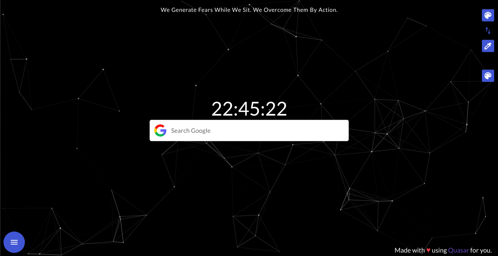
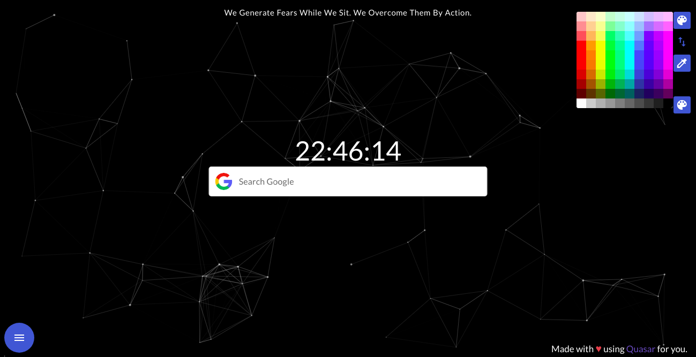
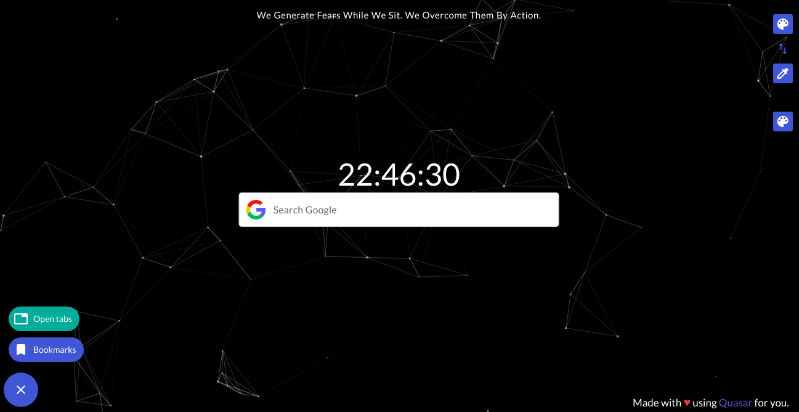

# Turbo Tabs - Chrome new tab extension


Replace new tab page with beautiful live pattern and access all open tabs link, all bookmarks and inspiration and much more!

Use this to be more productive, directly go to any open tabs from one place, access all bookmarks and open tabs with search. Customise all colours including live background and pattern. Easy google search, time, new inspirational thoughts on every tab and much more to come. Stay tuned and contact me at mayur091193@gmail.com for feedback or feature requests. 

Made with HTML, CSS, Quasar framework

## Note

Please note I've modified the structure on my own! And this repository is having the build of my own structure and not the Quasar BEX project! ***I would suggest you all to properly follow the Quasar BEX documentation! Quasar BEX mode is awesome and documentation is very well written!***

[Quasar BEX](https://quasar.dev/quasar-cli/developing-browser-extensions/preparation)

## Support

If this hepls you in any way, you can contribute to this project by supporting me:

### [💜 Support my open-source work on GitHub](https://github.com/sponsors/mayur091193)

Please check out my sponsor page.

(Every small appreciation can make my day!)

Thank you very much!!

## Built using

* [HTML](https://www.w3schools.com/html/)
* [CSS](https://www.w3schools.com/css/)
* [Quasar framework](https://quasar.dev/)


## Features

* Easy Google Search
* Easy access to all open tabs and bookmarks with search
* Directly navigate to any open tabs from one place
* Customizable colours for text, background colour, live pattern colour
* On each new tab - new inspirational thought

## Published on Chrome Web Store

[Trubo Tabs](https://chrome.google.com/webstore/detail/pfagelipodlapancgiiolcjafdbmjoob)

## How to run on local?

```
git clone https://github.com/mayur091193/turbo-tabs.git
```

Visit ```chrome://extensions/```

Click Load Unpacked(On top left) and select the cloned folder(ProTab) - This will add ProTab local extension to the Chrome.


## Screens UI






